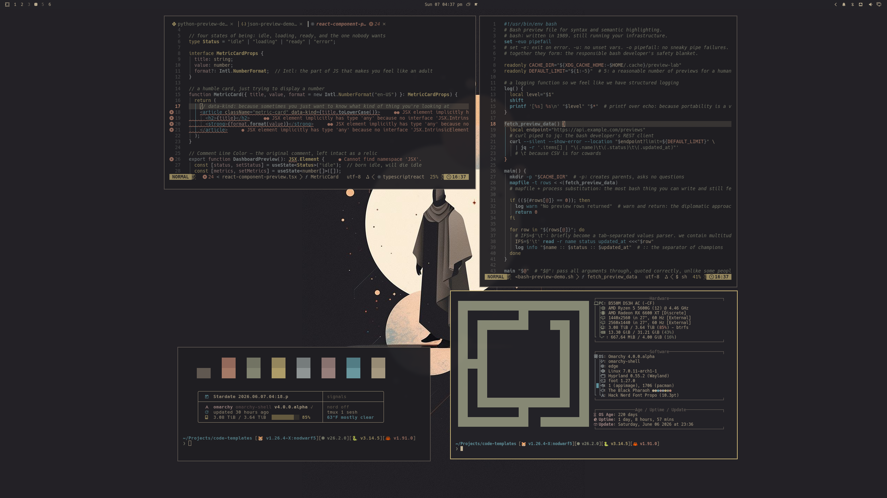
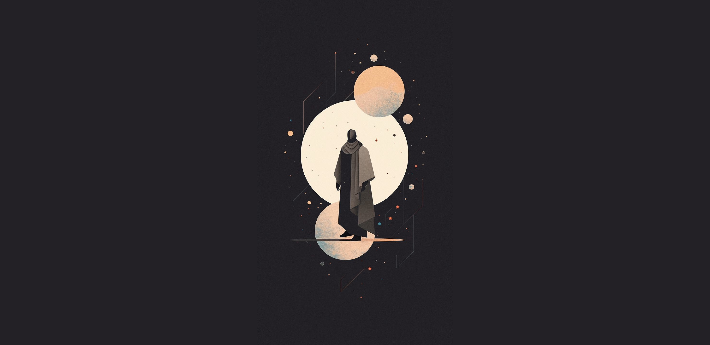
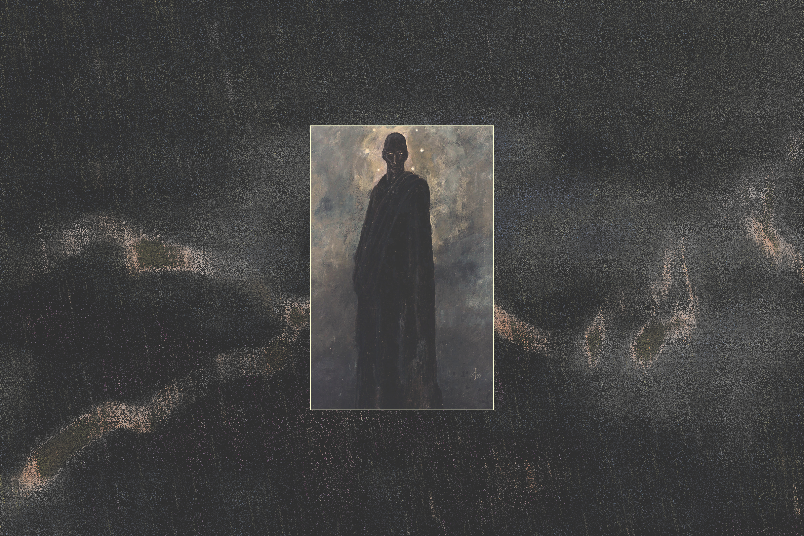
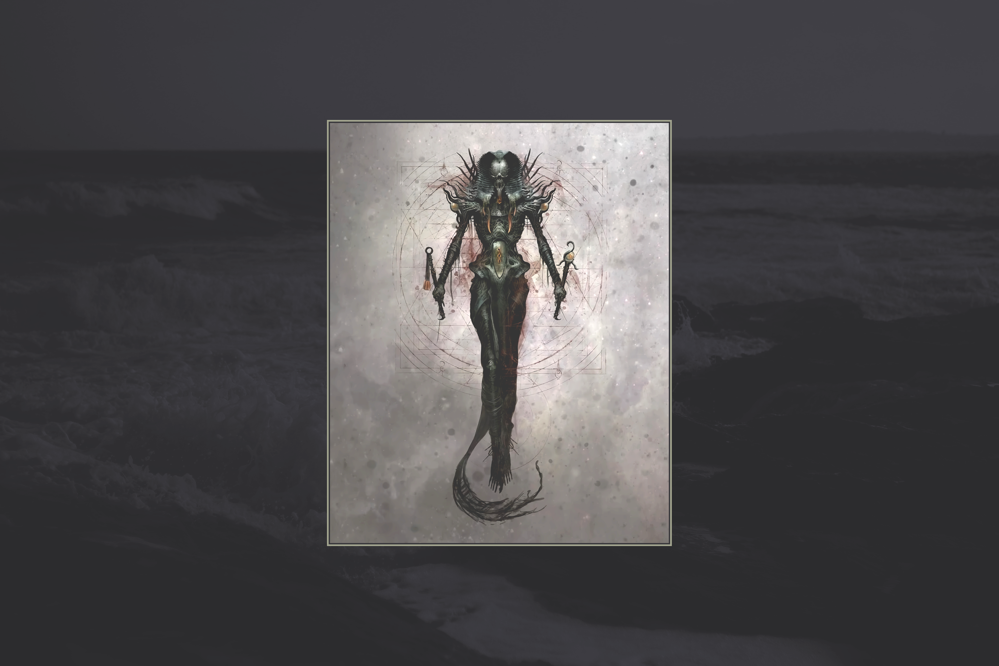
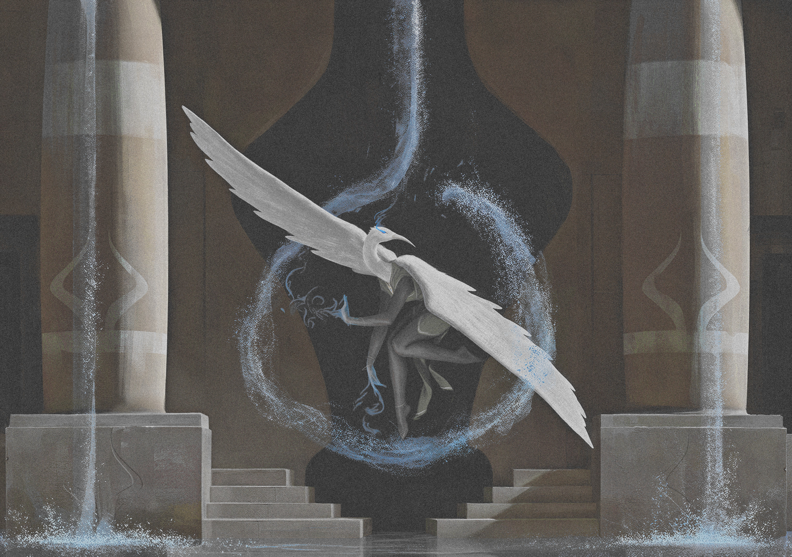
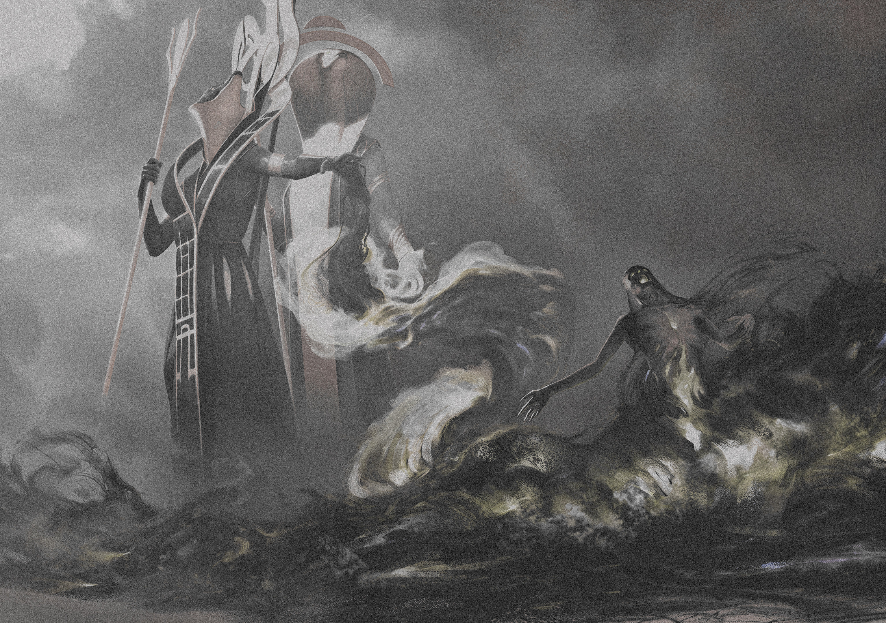

# Omarchy The Black Pharaoh Theme

The Black Pharaoh is a low-contrast Omarchy theme built around blackened plum, aged parchment, muted moonlight, dusty metal, and small cyan-gold state marks. It is dark and quiet by design: readable enough for daily work, but softened away from the hard white-on-black terminal look.

## Preview



## Install

Use the Omarchy theme installer:

```bash
omarchy-theme-install https://github.com/OldJobobo/omarchy-the-black-pharaoh-theme
```

## What's Included

- Base24 palette sources in `colors.toml` and `the-black-pharaoh-base24.yaml`.
- Omarchy desktop surfaces for shell, Hyprland, Hyprlock, Waybar, Walker, Mako, SwayOSD, GTK, and Chromium.
- Terminal themes for Alacritty, Foot, Ghostty, Kitty, Warp, and Zellij.
- App and editor coverage for btop, Neovim, Zed, VS Code, and Vencord.
- A customized Midnight-based Vencord theme with square corners and explicit read/unread channel state colors.
- Seven bundled wallpapers plus a desktop preview image.

## Palette

The theme keeps most UI on a narrow dark material ramp, with parchment foregrounds and restrained semantic color. WCAG contrast is measured against the primary background, `base00` / `#232227`; background and muted-structure colors are not intended for body text.

| Base24 | Swatch | Hex | Color name | YAML role | `colors.toml` key(s) | WCAG vs `#232227` |
| --- | --- | --- | --- | --- | --- | --- |
| `base00` |  | `#232227` | Crawling Void | default background | `base00`, `background`, `selection_foreground`, `color0` | 1.00:1 |
| `base01` |  | `#2f2d31` | Sealed Stone | lighter background | `base01`, `lighter_bg` | 1.16:1 |
| `base02` |  | `#454045` | Ashen Slab | selection background | `base02`, `selection` | 1.56:1 |
| `base03` |  | `#736a60` | Tomb Soot | comments / muted text | `base03`, `base0F`, `muted`, `brown`, `active_tab_background`, `color8` | 2.98:1 |
| `base04` |  | `#8f9696` | Corpse Moon Ash | dark foreground | `base04`, `base0D`, `dark_fg`, `blue`, `color4` | 5.24:1 |
| `base05` |  | `#b7a98d` | Dead Parchment | default foreground | `base05`, `foreground`, `color7` | 6.82:1 |
| `base06` |  | `#c9b99b` | Moon-Bone | light foreground | `base06`, `light_fg`, `cursor`, `color15` | 8.20:1 |
| `base07` |  | `#d9c9aa` | Lunar Vellum | brightest foreground | `base07`, `bright_fg` | 9.69:1 |
| `base08` |  | `#b17f6d` | Dried Blood Copper | red / error | `base08`, `red`, `color1` | 4.61:1 |
| `base09` |  | `#c7927a` | Flayed Planet | orange / warning | `base09`, `base12`, `orange`, `bright_red`, `color9` | 5.88:1 |
| `base0A` |  | `#b4a36f` | Cursed Brass | yellow | `base0A`, `yellow`, `color3` | 6.32:1 |
| `base0B` |  | `#898b77` | Funeral Cloak | green | `base0B`, `green`, `color2` | 4.53:1 |
| `base0C` |  | `#6296a0` | Star Rot Cyan | cyan | `base0C`, `accent`, `cyan`, `selection_background`, `color6` | 4.81:1 |
| `base0D` |  | `#8f9696` | Corpse Moon Ash | blue | `base04`, `base0D`, `dark_fg`, `blue`, `color4` | 5.24:1 |
| `base0E` |  | `#a58a86` | Bruised Stone | purple | `base0E`, `magenta`, `purple`, `color5` | 4.95:1 |
| `base0F` |  | `#736a60` | Tomb Soot | brown / special | `base03`, `base0F`, `muted`, `brown`, `active_tab_background`, `color8` | 2.98:1 |
| `base10` |  | `#18171b` | Inner Void | darker background | `base10`, `dark_bg` | 1.13:1 |
| `base11` |  | `#0d0c10` | Black Altar | darkest background | `base11`, `darker_bg` | 1.23:1 |
| `base12` |  | `#c7927a` | Flayed Planet | bright red | `base09`, `base12`, `orange`, `bright_red`, `color9` | 5.88:1 |
| `base13` |  | `#d2bd7d` | Idol Gold | bright orange / yellow | `base13`, `bright_yellow`, `active_border_color`, `color11` | 8.51:1 |
| `base14` |  | `#9c9f87` | Pallid Shroud | bright green | `base14`, `bright_green`, `color10` | 5.81:1 |
| `base15` |  | `#7eb7c0` | Crawling Starfire | bright cyan | `base15`, `bright_cyan`, `color14` | 7.09:1 |
| `base16` |  | `#adb5b4` | Ghoul Moonlight | bright blue | `base16`, `bright_blue`, `color12` | 7.56:1 |
| `base17` |  | `#b79a95` | Pallid Flesh | bright purple | `base17`, `bright_magenta`, `bright_purple`, `color13` | 6.07:1 |

See [DESIGN.md](DESIGN.md) for the contrast guidelines and role definitions.

## Wallpapers

<table>
  <tr>
    <td><br>The Black Pharaoh</td>
    <td><br>The Crawling Chaos</td>
    <td><br>Nyarlathotep</td>
  </tr>
  <tr>
    <td><br>Containment Priest</td>
    <td><br>Divert</td>
    <td><br>Maelstrom Pulse</td>
  </tr>
  <tr>
    <td><br>Mind Twist</td>
  </tr>
</table>

## Requirements

- Omarchy with `omarchy-theme-install`.
- Vencord or BetterDiscord only if you want to use `vencord.theme.css`.

## Notes

- The theme is intentionally low contrast. Read/default Discord channel text uses the dim theme lane, while unread channels use the bright foreground lane.
- `vencord.theme.css` imports Midnight from `https://refact0r.github.io/midnight-discord/build/midnight.css`.
- The VS Code extension files are included under `vscode-extension/`; the root `vscode.json` is also present for direct theme import workflows.

## Attribution

- Vencord theme base: [Midnight Discord](https://github.com/refact0r/midnight-discord) by refact0r.
- Wallpaper art for `Containment Priest`, `Divert`, `Maelstrom Pulse`, and `Mind Twist` by Igor Kieryluk.
