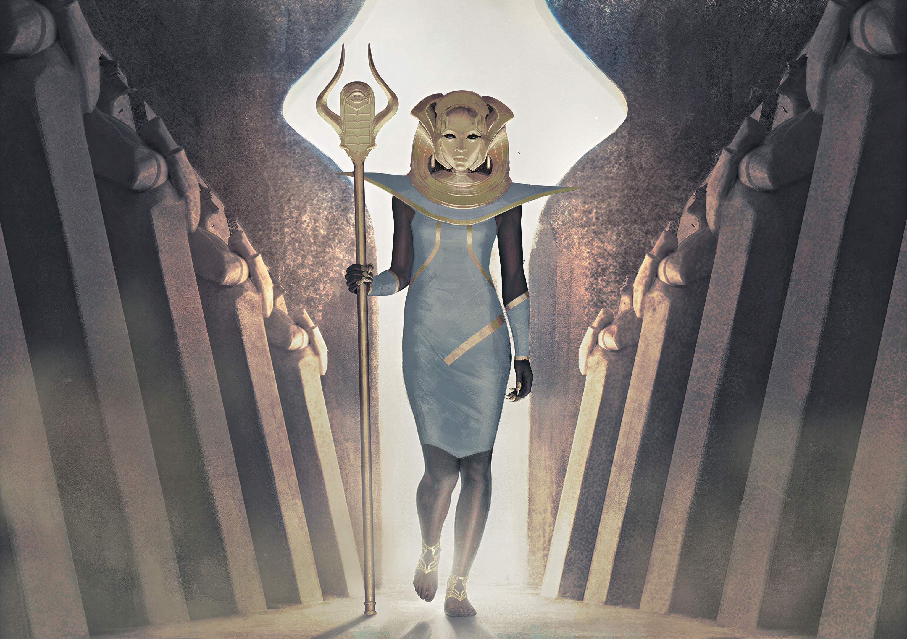
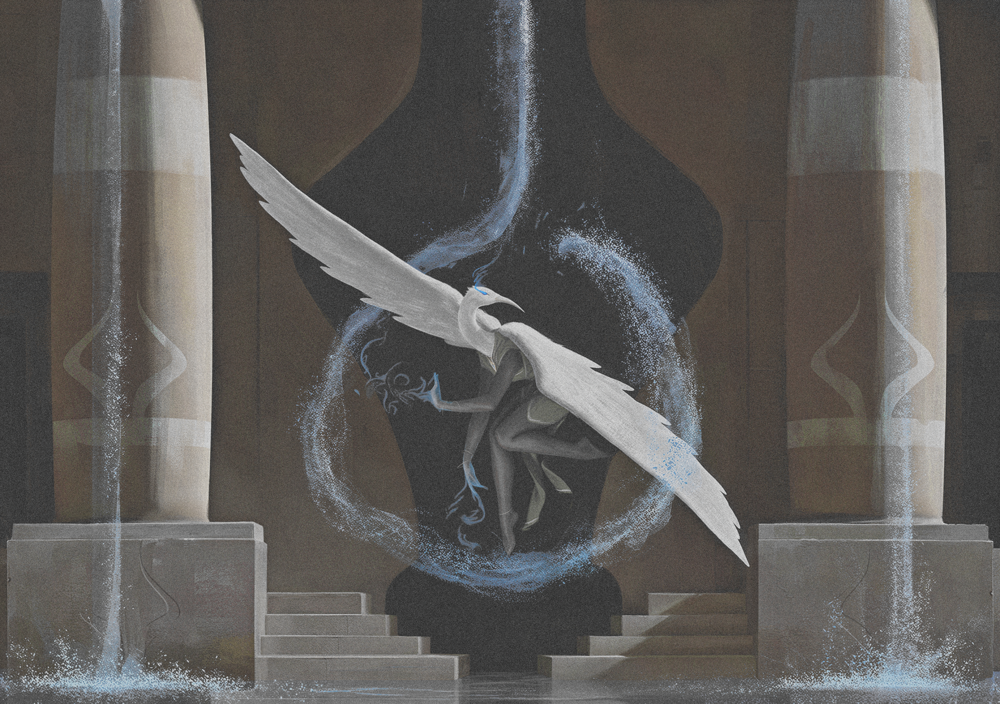
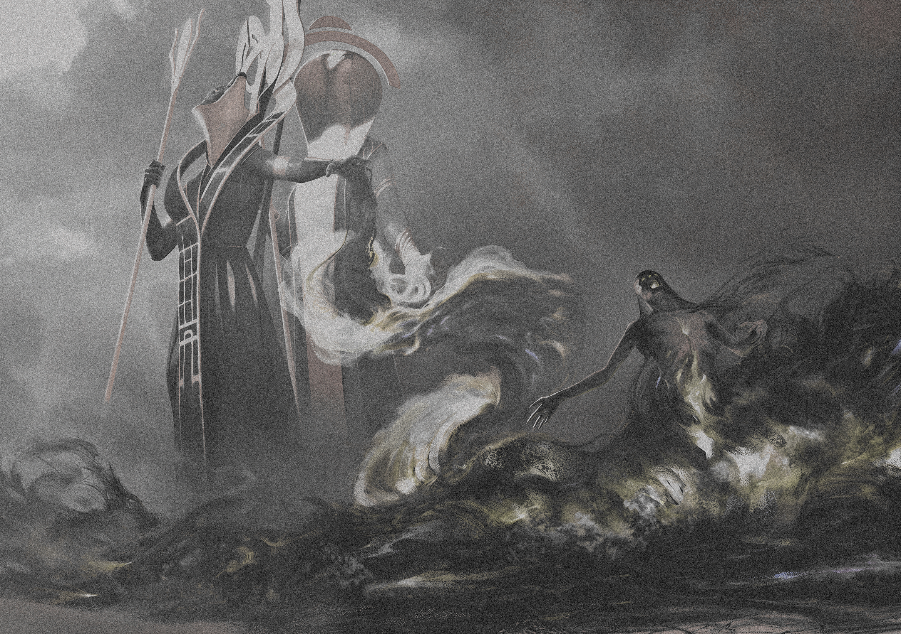

# Omarchy The Black Pharaoh Theme

The Black Pharaoh is a low-contrast Omarchy theme built around blackened plum, aged parchment, muted moonlight, dusty metal, and small cyan-gold state marks. It is dark and quiet by design: readable enough for daily work, but softened away from the hard white-on-black terminal look.

## Preview


## Install

Use the Omarchy theme installer:

```bash
omarchy-theme-install https://github.com/OldJobobo/omarchy-the-black-pharaoh-theme
```

## What's Included

- Base24 palette sources in `colors.toml` and `the-black-pharaoh-base24.yaml`.
- Omarchy desktop surfaces for shell, Hyprland, Hyprlock, Waybar, Walker, Mako, SwayOSD, GTK, and Chromium.
- Terminal themes for Alacritty, Foot, Ghostty, Kitty, Warp, and Zellij.
- App and editor coverage for btop, Neovim, Zed, VS Code, and Vencord.
- A customized Midnight-based Vencord theme with square corners and explicit read/unread channel state colors.
- Seven bundled wallpapers plus a desktop preview image.

## Palette

The theme keeps most UI on a narrow dark material ramp, with parchment foregrounds and restrained semantic color.

| Role | Color |
| --- | --- |
| Background | `#232227` |
| Dark background | `#18171b` |
| Muted / dim read state | `#736a60` |
| Foreground | `#b7a98d` |
| Light foreground | `#c9b99b` |
| Bright foreground | `#d9c9aa` |
| Accent cyan | `#6296a0` |
| Lunar gold | `#d2bd7d` |
| Copper error | `#b17f6d` |
| Cloak olive success | `#898b77` |

See [DESIGN.md](DESIGN.md) for the contrast guidelines and role definitions.

## Wallpapers

<table>
  <tr>
    <td></td>
    <td></td>
    <td></td>
  </tr>
  <tr>
    <td></td>
    <td></td>
    <td></td>
  </tr>
  <tr>
    <td></td>
  </tr>
</table>

## Requirements

- Omarchy with `omarchy-theme-install`.
- Vencord or BetterDiscord only if you want to use `vencord.theme.css`.

## Notes

- The theme is intentionally low contrast. Read/default Discord channel text uses the dim theme lane, while unread channels use the bright foreground lane.
- `vencord.theme.css` imports Midnight from `https://refact0r.github.io/midnight-discord/build/midnight.css`.
- The VS Code extension files are included under `vscode-extension/`; the root `vscode.json` is also present for direct theme import workflows.

## Attribution

- Vencord theme base: [Midnight Discord](https://github.com/refact0r/midnight-discord) by refact0r.
- Several wallpaper filenames retain source metadata naming Igor Kieryluk. Verify upstream wallpaper licensing before redistributing outside this theme repository.
